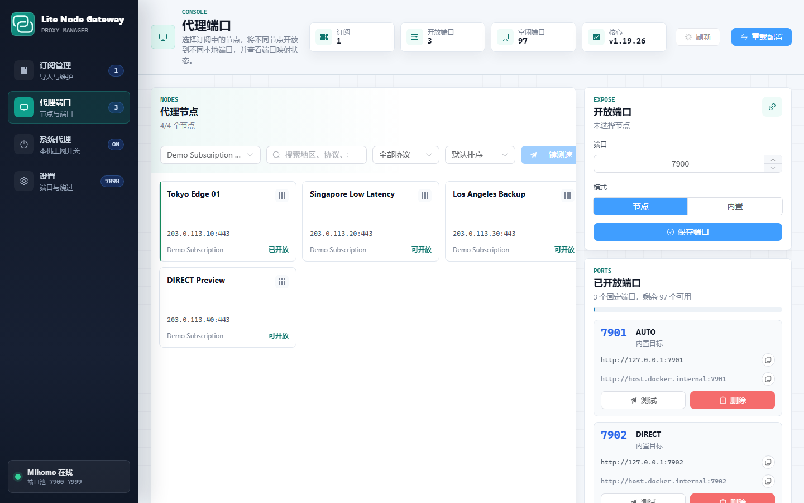

# Lite Node Gateway

Lite Node Gateway 是一个轻量级本地节点网关，用 `mihomo` 作为代理核心，提供一个 Manager Web 面板来管理订阅、节点和固定代理端口。

你可以把它理解成一个“本地代理端口分配器”：导入订阅后，选择某个节点，把它固定开放到 `7900-7999` 里的一个端口。之后其他程序、脚本或 Docker 容器就可以稳定使用这个端口，不用关心当前选中的是哪个节点。

## 功能

- 导入多个订阅地址
- 查看订阅节点并按端口固定暴露
- 支持内置目标 `AUTO`、`DIRECT`
- 自动生成并热重载 `mihomo` 配置
- 支持宿主机系统代理开关
- 支持 Docker 运行、Windows 便携包运行、Debian/Ubuntu `.deb` 安装

## 界面示例

下面截图使用的是虚构演示订阅和节点，只用于展示界面效果。



## 默认地址

| 服务 | 地址 |
| --- | --- |
| Manager 管理面板 | `http://127.0.0.1:8089` |
| MetaCubeXD 面板 | `http://127.0.0.1:8088` |
| Mihomo 控制接口 | `http://127.0.0.1:9090` |
| 主代理端口 | `http://127.0.0.1:7896` |
| 固定端口池 | `http://127.0.0.1:7900-7999` |
| System proxy helper | `http://127.0.0.1:18089/api/system-proxy` |

默认只绑定到 `127.0.0.1`，适合本机和 Docker Desktop 内的本地容器使用。如果部署到服务器并希望外部机器访问，需要修改端口绑定、防火墙和访问控制。

## 使用方式一：Docker

适合源码运行、开发调试，或者已经安装 Docker Desktop 的机器。

Windows：

```powershell
cd C:\project\lite-node-gateway
.\start.ps1 -Build
```

Linux：

```bash
cd /path/to/lite-node-gateway
bash ./start.sh --build
```

查看状态：

```powershell
docker compose ps
```

停止：

```powershell
docker compose down
```

`start.ps1` / `start.sh` 会先启动宿主机 system proxy helper，再启动 Docker 服务。直接运行 `docker compose up -d` 也能启动网关核心服务，但系统代理页会因为 helper 没有启动而不可用。

Docker 模式会启动三个服务：

- `mihomo`：代理核心
- `dashboard`：MetaCubeXD 面板
- `manager`：本项目的管理面板

## 使用方式二：Windows 便携包

适合不想安装 Docker 的 Windows 用户。便携包不需要 Python、Node 或 Docker。

先构建：

```powershell
.\packaging\windows\build-windows.ps1
```

构建完成后运行：

```powershell
.\dist\lite-node-gateway-windows\lite-node-gateway.exe
```

也可以把整个目录复制到其他 Windows x64 电脑上运行：

```text
dist\lite-node-gateway-windows\
```

注意要复制整个目录，不要只复制 `lite-node-gateway.exe`。目录里需要包含：

```text
lite-node-gateway.exe
manager.exe
system-proxy-helper.exe
bin\mihomo.exe
```

便携包默认数据目录：

```text
dist\lite-node-gateway-windows\data
```

冒烟测试：

```powershell
.\dist\lite-node-gateway-windows\lite-node-gateway.exe --no-browser --run-seconds 5
```

如果默认端口被占用，可以临时指定端口：

```powershell
.\dist\lite-node-gateway-windows\lite-node-gateway.exe `
  --manager-port 8091 `
  --proxy-port 7898 `
  --controller-port 9191 `
  --helper-port 18091
```

Windows 便携包当前包含 Manager 和 `mihomo` 核心，不包含 MetaCubeXD 独立面板。日常管理订阅和端口直接使用 Manager 即可。

## 使用方式三：Debian/Ubuntu deb 包

适合 Linux 服务器或桌面环境，不需要 Docker。

构建：

```powershell
.\packaging\deb\build-deb.ps1
```

生成文件：

```text
dist\lite-node-gateway_0.1.0_amd64.deb
```

在 Debian/Ubuntu 安装：

```bash
sudo apt install ./lite-node-gateway_0.1.0_amd64.deb
```

安装后服务会注册到 systemd：

```bash
sudo systemctl status lite-node-gateway-mihomo
sudo systemctl status lite-node-gateway-manager
```

常用操作：

```bash
sudo systemctl restart lite-node-gateway-mihomo lite-node-gateway-manager
sudo systemctl stop lite-node-gateway-manager
```

默认 Linux 数据目录：

```text
/var/lib/lite-node-gateway
```

`.deb` 包内置 Linux 版 `mihomo`，但依赖系统提供：

```text
python3
python3-requests
python3-yaml
systemd
```

用 `apt install ./xxx.deb` 安装时，缺失依赖会自动处理。

## 使用方式四：旧脚本

旧脚本仍可用，但建议优先使用 Manager 面板。

```powershell
.\scripts\list-nodes.ps1
.\scripts\bind-port.ps1 -Port 7901 -Node AUTO
.\scripts\list-port-bindings.ps1
```

## Web 管理流程

打开 Manager：

```text
http://127.0.0.1:8089
```

常用流程：

1. 进入订阅管理页
2. 导入一个或多个订阅地址
3. 切到代理端口页
4. 选择订阅和节点
5. 填写端口，例如 `7903`
6. 点击保存端口

保存后会自动生成 `mihomo` 配置并热重载，不需要手动重启容器或进程。

应用里使用固定端口：

```text
http://127.0.0.1:7903
```

另一个 Docker 容器访问宿主机端口时，例如 `sub2api`：

```text
protocol: http
host: host.docker.internal
port: 7903
```

## 验证代理

宿主机测试：

```powershell
Invoke-WebRequest -UseBasicParsing `
  -Uri 'https://ipinfo.io/json' `
  -Proxy 'http://127.0.0.1:7903' `
  -TimeoutSec 60
```

从另一个 Docker 容器测试：

```powershell
docker exec sub2api sh -lc 'curl -sS --max-time 60 -x http://host.docker.internal:7903 https://ipinfo.io/json'
```

检查 Manager 健康状态：

```powershell
Invoke-RestMethod http://127.0.0.1:8089/api/health
```

## 数据文件

Docker / 源码模式：

```text
data\manager-state.json
data\subscriptions\*.yaml
data\config.yaml
data\config.yaml.before-manager
```

Windows 便携包：

```text
dist\lite-node-gateway-windows\data
```

Debian/Ubuntu：

```text
/var/lib/lite-node-gateway
```

订阅 URL 会保存在本地状态文件里，用于刷新订阅；Web API 返回时会自动隐藏 `token`、`key`、`secret`、`password` 等敏感查询参数。

## 构建产物

Windows：

```powershell
.\packaging\windows\build-windows.ps1
```

输出：

```text
dist\lite-node-gateway-windows\
```

Debian/Ubuntu：

```powershell
.\packaging\deb\build-deb.ps1
```

输出：

```text
dist\lite-node-gateway_0.1.0_amd64.deb
```

构建输出、下载的二进制依赖和临时文件位于 `dist/`、`build/`、`vendor/`，这些目录默认不会提交到 Git。

## 注意事项

- Windows 首次运行未签名 exe 时，可能会出现 SmartScreen 或 Defender 提示。
- 如果 `8089`、`7896`、`9090`、`7900-7999` 被占用，需要先停止冲突程序或改用自定义端口。
- Linux 系统代理功能依赖桌面环境的 `gsettings` 后端；服务器或 headless 环境通常没有系统代理后端，但订阅、端口映射和代理核心仍可正常使用。
- 如果要把服务开放给局域网或公网，请先设置访问控制，避免暴露 `mihomo` 控制接口和代理端口。
